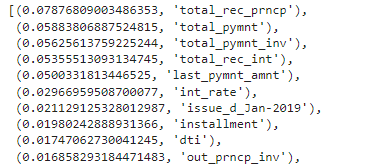

# Analysis of credit risk using Machine Learning algorithms 

## Overview

Employ different techniques to assess credit risk using different Machine Learning models. The data is unbalanced due to the high number of good loans and the small number of "risky loans". The imbalanced-learn and scikit-learn libraries were used to conduct this analysis. The following is a comparison of the outcome of each. As you can expect, some performed better than others.

## Results of All Resampling Models

### RandomOverSampler

As you can see here, the perforance is very poor when it comes to detecting high risk cases. However, the F1 score of .82 when it comes to low risk cases is pretty strong. 

### SMOTE

The SMOTE model produces similar numbers to the RandomOverSampler with a miniscule f1 score for high risk and an even stronger (.85) f1 score for low risk cases. 

### ClusterCentroids

The ClusterCentroids appears to be a very poor model to use in this scenario. Similar to the other models it performs very poorly when it comes to high risk cases. The low risk cases score is lower at .70. It should be noted that the accuracy score of this model is only .53 or 53%. 

### SMOTEENN

The performance of the SMOTEENN model is similar to the RandomOverSampler and SMOTE models with low f1 score for high risk cases and strong f1 score for low risk cases. The accuracy score for the SMOTEEN model is at .65 or 65% which is stronger than the accuracy for the ClusterCentroids. 

### BalancedRandomForestClassifier

The accuracy score for this model is .78 or 78%, which is a big improvement from the previous models. The f1 score for the high risk cases is only a tad higher than the others, but the low risk f1 score is .93. 

Here you can see the 10 most important features when it comes to predicting a high or low risk credit case.  

### EasyEnsembleClassifier

The accuracy score for this model is .93 or 93% which is the highest out of all the models. The f1 scores also show a low score for the high risk cases and a high score (.97) for the low risk cases. 

## Summary

There is a great degree of uncertainty when it comes to predicting credit risk. Most of these models were very good at predicting low risk cases, but struggled with the high risk scenario. However, I recommend the EasyEnsembleClassifier model due to the very high accuracy score. 